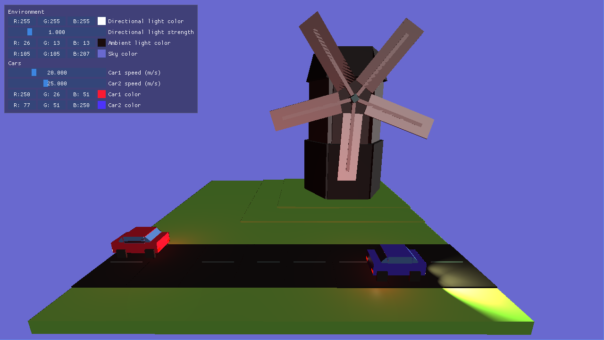

## Lab2

Мы реализовали программу, демонстрирующую небольшую сценку с машинками и мельницей.

Программа может находится в двух режимах:

1. Просмотр
2. Редактирование

Переключаться между режимами можно с помощью клавиши `Tab`.

В обоих режимах можно двигать камеру с помощью `WASD`, `Space` и `Shift`.

В режиме просмотра также можно манипулировать углом поворота камеры с помощью перемещение мышки.

В режиме редактирования можно менять некоторые параметры:

- Цвет удалённого направленного света
- Интенсивность удалённого направленного света
- Цвет фонового освещения
- Цвет неба
- Цвет машинок
- Скорость машинок