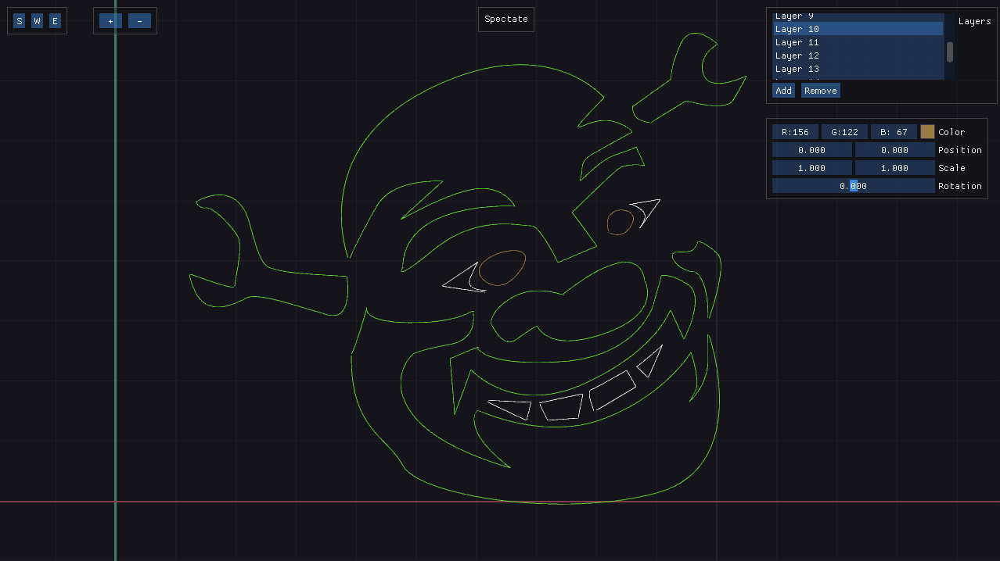

## Lab4

Приложение, в котором можно рисовать кубические кривые Безье на разных слоях. [Отчёт по работе](report.pdf).

Приложение может находится в трёх состояниях:

1. **Spectate**. Выбранный слой ничем не выделяется. Служит для просмотра того, что в итоге получилось.
2. **Workspace**. Все слои, кроме выбранного, прозрачные.
3. **Edit**. Можно добавлять и убирать точки для выбранного слоя.

Переключаться между состояниями можно по нажатию на кнопку на панели состояний, где `S` -- **Spectate**, `W` -- **Workspace**, `E` -- **Edit**. Также можно проходить по цепочке *exit* <-> **Spectate** <-> **Workspace** <-> **Edit** по нажатию на `Esc` и `Space`.

Текущий режим можно узнать по надписи сверху посередине.

Слои можно:

1. Двигать. С помощью смены атрибута Position в интерфейсе или в состоянии **Workspace** нажатием на кнопку `G` на клавиатуре (Grab) с последующем манипулированием мышкой (`ЛКМ` -- сохранить, `Esc` -- отменить).
2. Масштабировать. С помощью смены атрибута Scale в интерфейсе или в состоянии **Workspace** нажатием на кнопку `S` на клавиатуре (Scale) с последующем манипулированием мышкой (`ЛКМ` -- сохранить, `Esc` -- отменить).
3. Поворачивать. С помощью смены атрибута Rotation в интерфейсе или в состоянии **Workspace** нажатием на кнопку `R` на клавиатуре (Rotate) с последующем манипулированием мышкой (`ЛКМ` -- сохранить, `Esc` -- отменить).
4. Менять цвет. С помощью атрибута Color в интерфейсе.
5. Добавлять. По нажатию на кнопку Add в интерфейсе или в состоянии **Workspace** нажатием на кнопку `N` на клавиатуре (New).
6. Удалять. По нажатию на кнопку Remove в интерфейсе или в состоянии **Workspace** нажатием на кнопку `D` на клавиатуре (Delete).

Чтобы выбрать слой, достаточно нажать на соответствующий слой в списке слоёв в интерфейсе, либо в режиме **Workspace** с помощью клавиш `X` и `Z` для выбора следующего и предыдущего слоя соответственно.

Во время редактирования слоя можно добавлять точки с помощью `ЛКМ` и удалять последнюю поставленную точку с помощью `ПКМ`. Таким образом мы ставим прямые. Чтобы сделать из них кривые, нужно их "вытянуть" с помощью зажатия `ЛКМ`. Принцип работы аналогичен программам Gimp, Photoshop.

Можно также манипулировать камерой:
- Двигать с помощью зажатого колёсика мыши.
- Масштабировать с помощью прокрутки колеса мыши или с помощью кнопок `+` и `-` в интерфейсе.